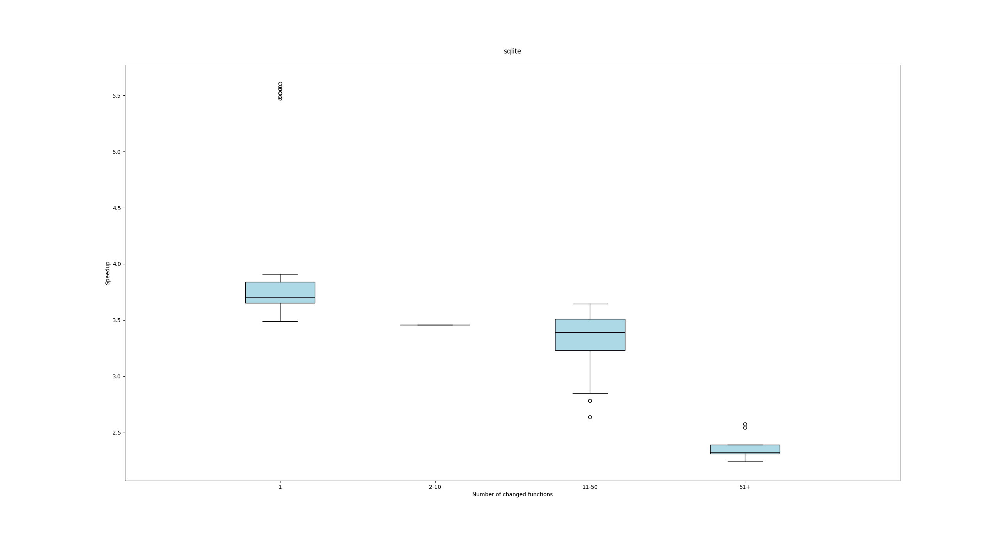
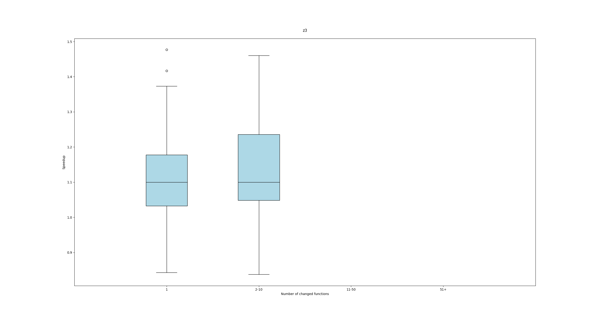
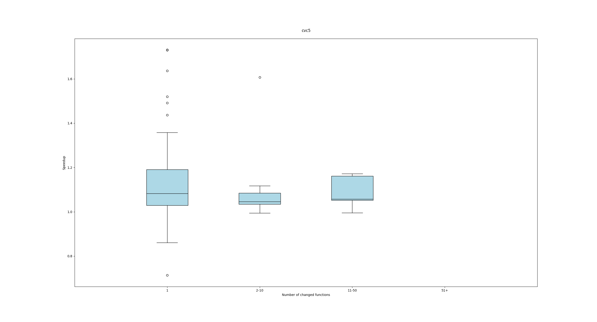

# IClang-rebuttal

The vast majority of commits in LLVM and CPython involve changes to only one function. Therefore, we only conduct experiments on SQLite, Z3, and CVC5 here.

(1) SQLite

| Number of changed functions | Number of commits | Average Speedup |
| --------------------------- | ----------------- | --------------- |
| 1                           | 50                | 4.09            |
| 2-10                        | 1                 | 3.46            |
| 11-50                       | 41                | 3.34            |
| 51+                         | 8                 | 2.37            |

(2) Z3

| Number of changed functions | Number of commits | Average Speedup |
| --------------------------- | ----------------- | --------------- |
| 1                           | 80                | 1.11            |
| 2-10                        | 20                | 1.15            |
| 11-50                       | -                 | -               |
| 51+                         | -                 | -               |

(3) CVC5

| Number of changed functions | Number of commits | Average Speedup |
| --------------------------- | ----------------- | --------------- |
| 1                           | 83                | 1.13            |
| 2-10                        | 12                | 1.10            |
| 11-50                       | 5                 | 1.09            |
| 51+                         | -                 | -               |